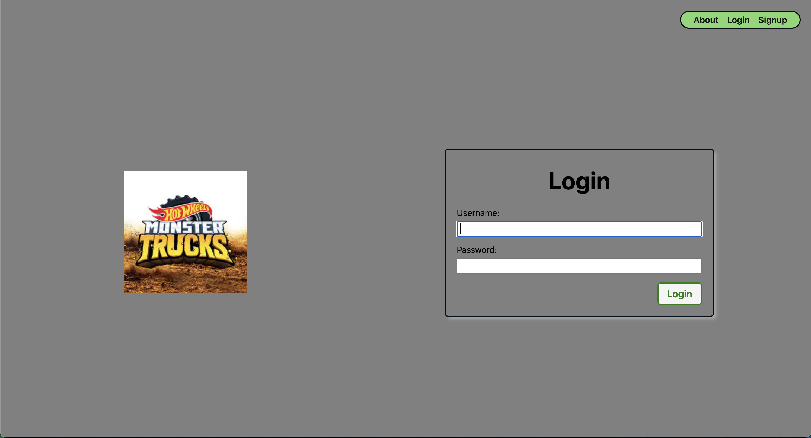

# Django-crud-app-project

 

<a href="https://monstertruck-collector-b461a18e1a20.herokuapp.com/">Click here to start adding Monster Trucks to your collection</a>

# ***Created by Kristian O'Brien***

Hey everyone! Welcome to my final project here at General Assembly this journey has been changeling but was very worth it! This project may seem simple but it means so much to me. This project highlights some of the best moments in my life I hope you like it!

# App Concept

- This app was created and inspired by a toddler who loves monster trucks. He enjoys collecting and playing with as many different monster trucks as possible. In this app, you can log all the monster trucks in your collection. You have the ability to edit any post you create in case you made a mistake or want to make changes. You can also delete a truck if it breaks or if you no longer have it. Lastly, you can view every single one of your trucks in the collection.

# ***Resources used while making this app.***

- <a href="https://generalassemb.ly/">General Assembly</a>
- <a href="https://www.google.com/">Google</a>

# Things I would like to add to the game in the future

- I would like to add the option to include more toys in my app, not just monster trucks — users can add anything they collect.
- I want to add the ability to insert custom pictures of your items.

